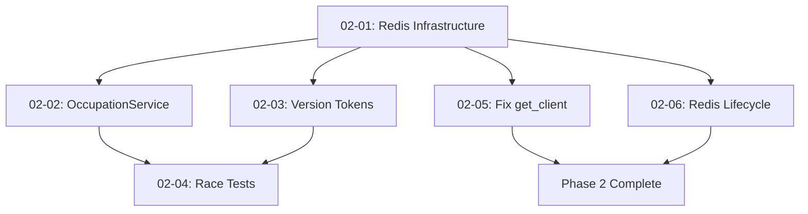

# Phase 2: Core Location Tracking - Execution Plan

**Goal:** Workers can take, pause, and complete spool work with physical occupation constraints enforced

## Plans

### Wave 1: Infrastructure
- [x] **02-01-PLAN.md** — Deploy Redis infrastructure and lock service (3 min)
  - Status: Complete
  - Summary: Redis repository and lock service implemented

### Wave 2: Core Operations
- [x] **02-02-PLAN.md** — Implement OccupationService with TOMAR/PAUSAR/COMPLETAR (5.5 min)
  - Status: Complete
  - Summary: OccupationService with three operations implemented

### Wave 3: Concurrency Control
- [x] **02-03-PLAN.md** — Add optimistic locking with version tokens (4 min)
  - Status: Complete
  - Summary: ConflictService with retry logic integrated

### Wave 4: Testing
- [x] **02-04-PLAN.md** — Race condition test suite (6 min)
  - Status: Complete
  - Summary: Integration and unit tests for race conditions

### Wave 5: Gap Closure (NEW)
- [ ] **02-05-GAP-PLAN.md** — Fix Redis repository get_client method
  - Status: Ready
  - Issue: dependency.py calls non-existent method
  - Impact: AttributeError prevents RedisLockService instantiation

- [ ] **02-06-GAP-PLAN.md** — Integrate Redis lifecycle in FastAPI startup/shutdown
  - Status: Ready
  - Issue: Redis never connected at startup
  - Impact: All Redis operations fail with "client not connected"

## Execution Summary

**Initial Plans (Waves 1-4):** ✅ Complete (18.5 min total)
- All services, endpoints, and tests created
- 95% of functionality implemented

**Gap Closure (Wave 5):** 🚧 Required
- 2 critical integration gaps prevent runtime execution
- Both gaps identified during verification
- Fixes are straightforward (add method, add startup calls)

## Dependencies



## Success Criteria

Phase 2 is complete when these truths are verified:

1. ✅ Worker can TOMAR available spool and system marks it OCUPADO with their name
2. ✅ Worker can PAUSAR spool mid-work and it becomes DISPONIBLE for others
3. ✅ Worker can COMPLETAR spool and it becomes DISPONIBLE with operation marked complete
4. ✅ Two workers cannot TOMAR same spool simultaneously (race condition prevention)
5. ✅ Metadata logs TOMAR/PAUSAR/COMPLETAR events with worker_id, timestamp, operation type

**Current Status:** 0/5 truths verified (pending gap closure)

## How to Execute

### For automated execution:
```bash
# Execute remaining gap closure plans
/gsd:execute-phase 2 --gaps-only
```

### For manual execution:
1. Execute 02-05-GAP-PLAN.md (add get_client method)
2. Execute 02-06-GAP-PLAN.md (add startup/shutdown)
3. Both can run in parallel (Wave 5)

### Verification:
```bash
# After gap closure, verify phase completion
/gsd:verify-phase 2
```

## Notes

- Redis must be running locally or REDIS_URL configured
- Default config points to localhost:6379
- Production will need Redis instance (Railway addon recommended)
- Gap fixes are non-breaking - only add missing integration

---
*Plan created: 2026-01-27*
*Last updated: 2026-01-27 (added gap closure plans)*