# ZEUES v4.0 - Esquema Completo de la Aplicación

> **Propósito:** Visualizar desde una sola vista todos los flujos, condiciones, datos capturados y árboles de decisión de la aplicación ZEUES.

> **Paleta de colores Blueprint Industrial:**
> - `#001F3F` Navy - Base/Principal
> - `#FF6B35` Orange - Acento/Acción
> - `#0D9488` Teal - Completado/Aprobado
> - `#D97706` Amber - Pausa/Advertencia
> - `#BE123C` Rose - Error/Rechazo
> - `#881337` Crimson - Bloqueado/Crítico
> - `#475569` Slate - Neutro/Cancelado
> - `#4338CA` Indigo - Conflicto/Especial
> - `#0891B2` Cyan - Metrología/Inspección
> - `#0369A1` Sky - Información/Datos

---

## 1. Flujo General de la Aplicación (UI)

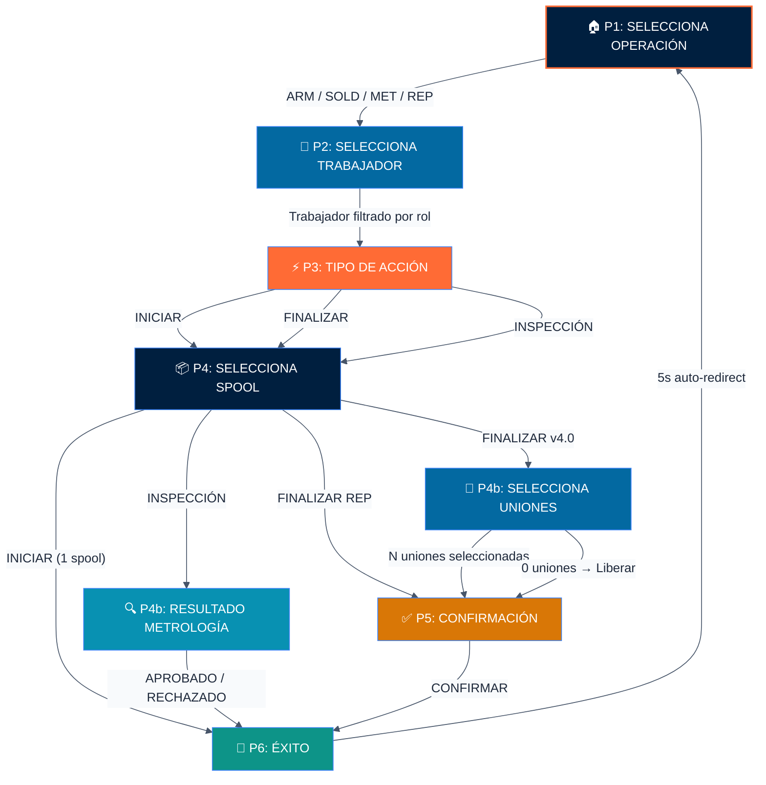

---

## 2. Árbol de Decisión P3: ¿Qué acciones ve el usuario?

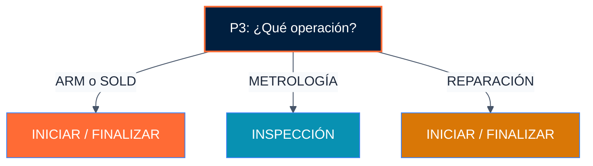

---

## 3. Flujo Completo: ARMADO (ARM)

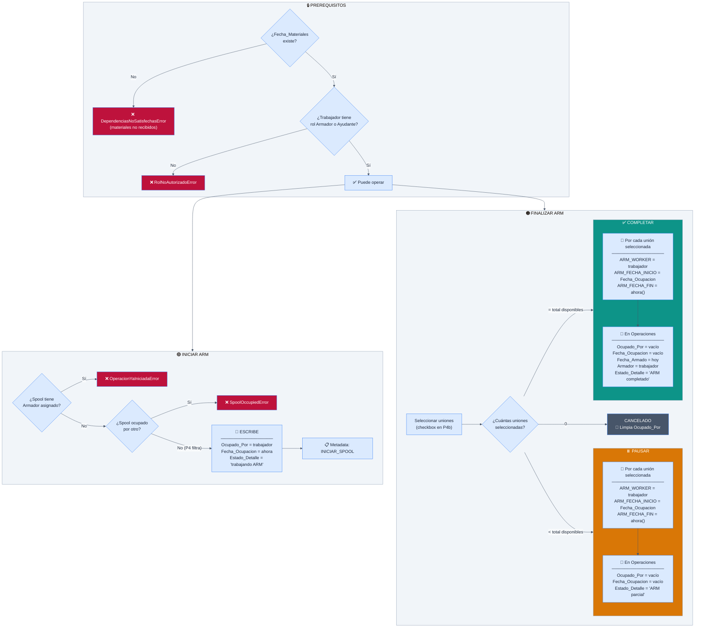

### Máquina de Estados ARM

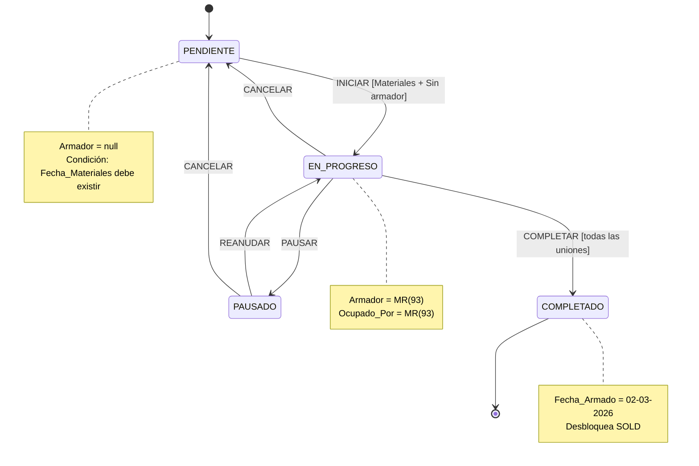

---

## 4. Flujo Completo: SOLDADURA (SOLD)

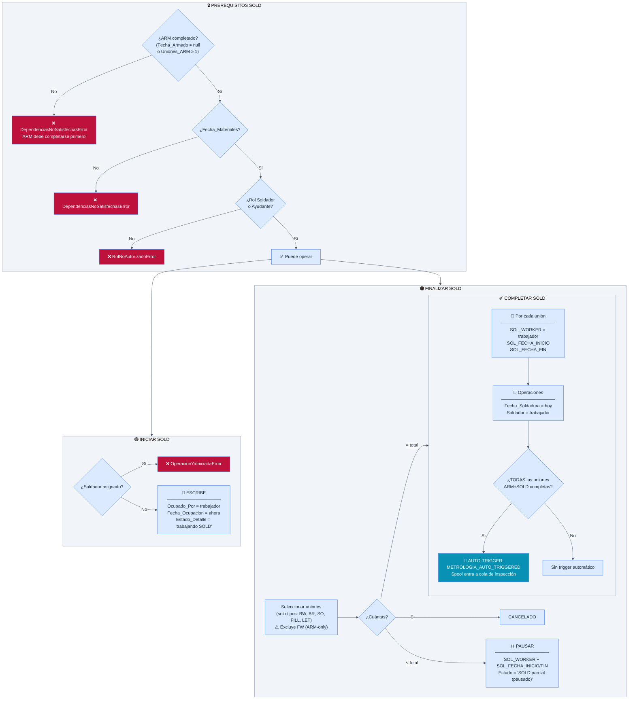

### Máquina de Estados SOLD

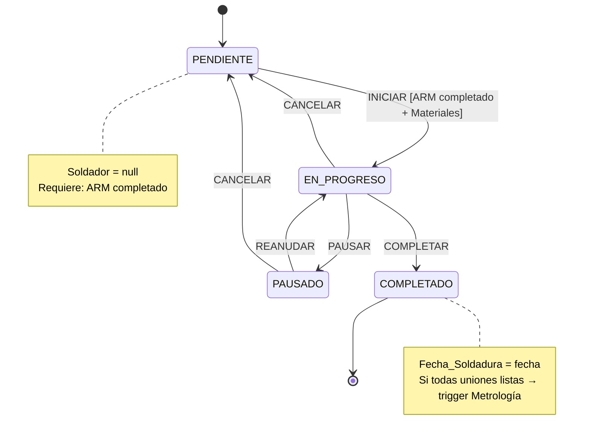

---

## 5. Flujo Completo: METROLOGÍA

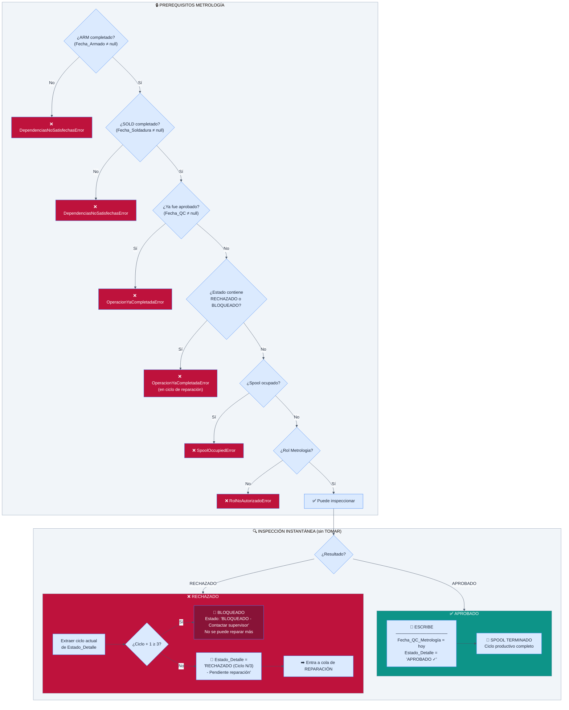

### Máquina de Estados Metrología

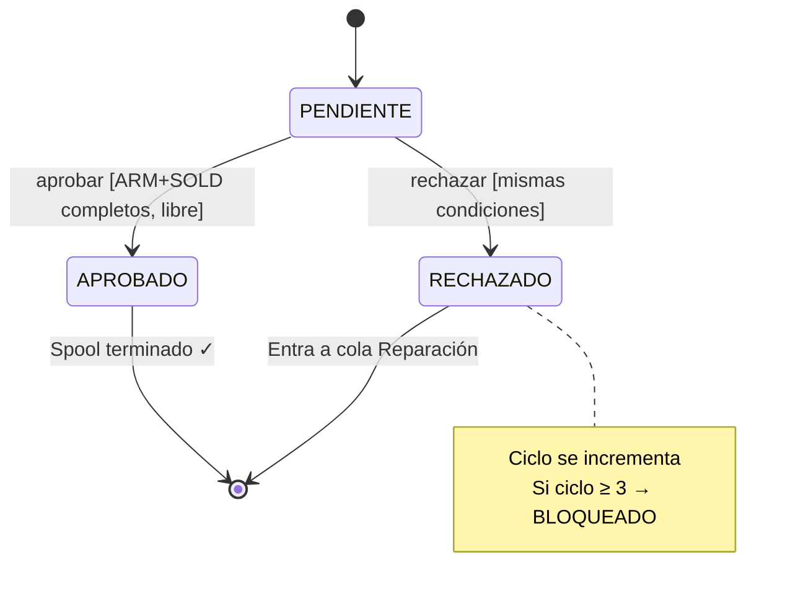

---

## 6. Flujo Completo: REPARACIÓN (Ciclos Acotados)

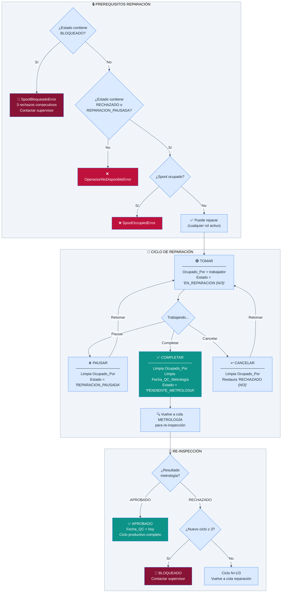

### Máquina de Estados Reparación

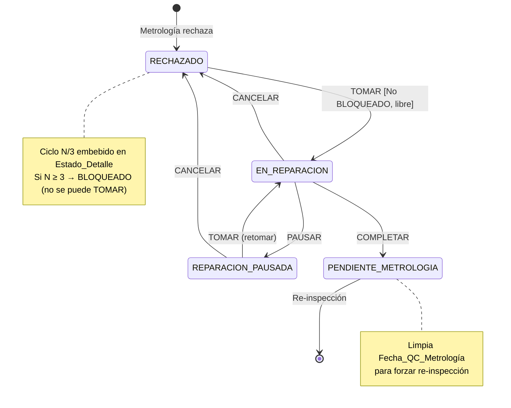

---

## 7. Pipeline Completo: Ciclo de Vida de un Spool

```mermaid
%%{init: {'theme':'base','themeVariables':{'primaryColor':'#DBEAFE','primaryBorderColor':'#3B82F6','primaryTextColor':'#1E293B','secondaryColor':'#E0E7FF','tertiaryColor':'#F0F9FF','lineColor':'#475569','clusterBkg':'#F1F5F9','clusterBorder':'#94A3B8','nodeBorder':'#3B82F6','mainBkg':'#DBEAFE','edgeLabelBackground':'#F8FAFC'}}}%%
flowchart LR
    subgraph MATERIALES["📦 MATERIALES"]
        M1["Fecha_Materiales<br/>(prerequisito externo)"]
    end

    subgraph ARM_PHASE["🔧 ARMADO"]
        ARM_P["PENDIENTE"] -->|"INICIAR"| ARM_E["EN PROGRESO"]
        ARM_E -->|"FINALIZAR<br/>(todas uniones)"| ARM_C["COMPLETADO"]
        ARM_E -.->|"PAUSAR"| ARM_PA["PAUSADO"]
        ARM_PA -.->|"REANUDAR"| ARM_E
    end

    subgraph SOLD_PHASE["🔥 SOLDADURA"]
        SOLD_P["PENDIENTE"] -->|"INICIAR"| SOLD_E["EN PROGRESO"]
        SOLD_E -->|"FINALIZAR<br/>(todas uniones)"| SOLD_C["COMPLETADO"]
        SOLD_E -.->|"PAUSAR"| SOLD_PA["PAUSADO"]
        SOLD_PA -.->|"REANUDAR"| SOLD_E
    end

    subgraph MET_PHASE["🔍 METROLOGÍA"]
        MET_P["PENDIENTE"] -->|"APROBADO"| MET_A["✅ APROBADO"]
        MET_P -->|"RECHAZADO"| MET_R["❌ RECHAZADO"]
    end

    subgraph REP_PHASE["🔄 REPARACIÓN"]
        REP_E["EN REPARACIÓN"] -->|"COMPLETAR"| REP_PM["PENDIENTE<br/>METROLOGÍA"]
        MET_R -->|"TOMAR"| REP_E
        REP_PM -->|"Re-inspección"| MET_P
        MET_R -->|"Ciclo ≥ 3"| BLOQ["🚫 BLOQUEADO"]
    end

    M1 -->|"Desbloquea"| ARM_P
    ARM_C -->|"Desbloquea"| SOLD_P
    SOLD_C -->|"Auto-trigger<br/>si todas uniones listas"| MET_P

    style M1 fill:#475569,color:#fff
    style ARM_C fill:#0D9488,color:#fff
    style SOLD_C fill:#0D9488,color:#fff
    style MET_A fill:#0D9488,color:#fff
    style MET_R fill:#BE123C,color:#fff
    style BLOQ fill:#881337,color:#fff
```

---

## 8. Datos Capturados por Operación

### Tabla Resumen: ¿Qué se escribe y cuándo?

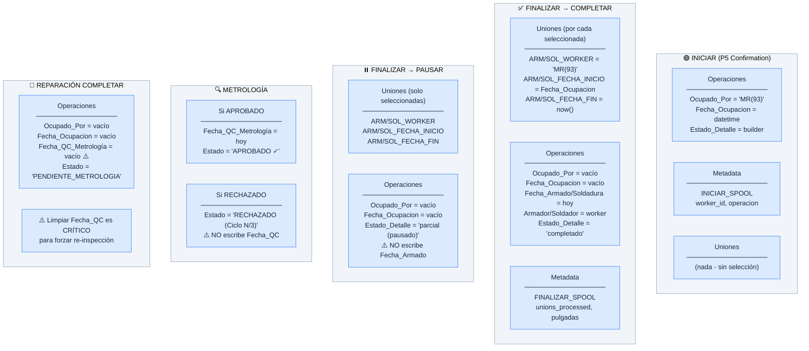

---

## 9. Tipos de Uniones y Elegibilidad

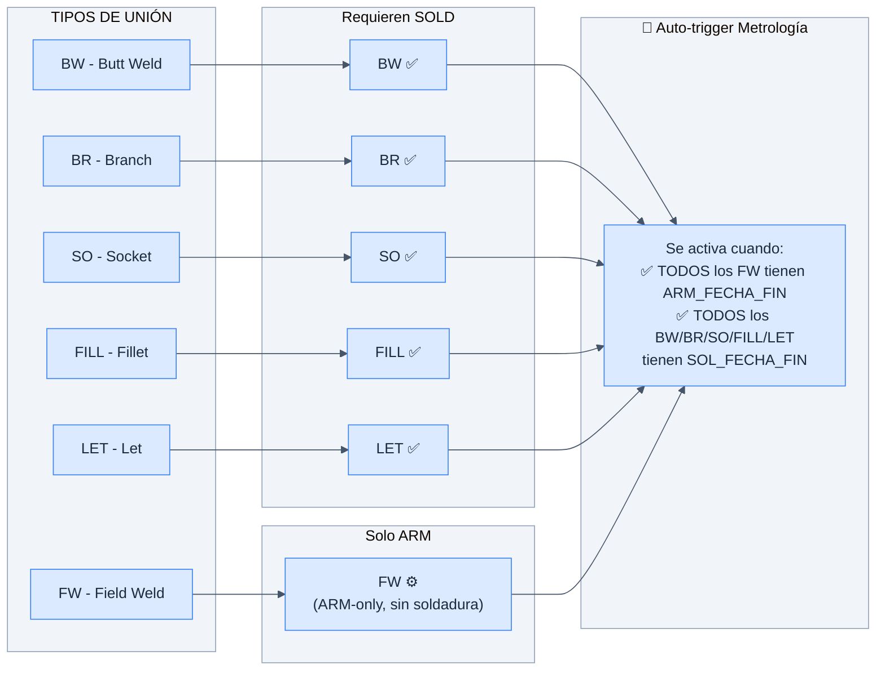

---

## 10. Filtrado de Spools en P4

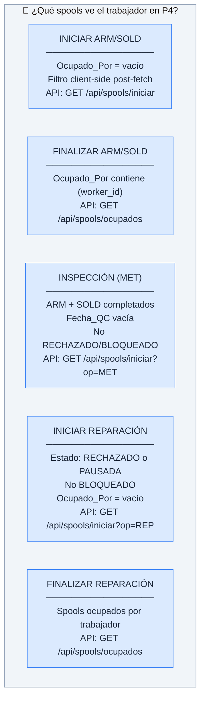

---

## 11. Modelo de Datos: Relación Spool ↔ Uniones

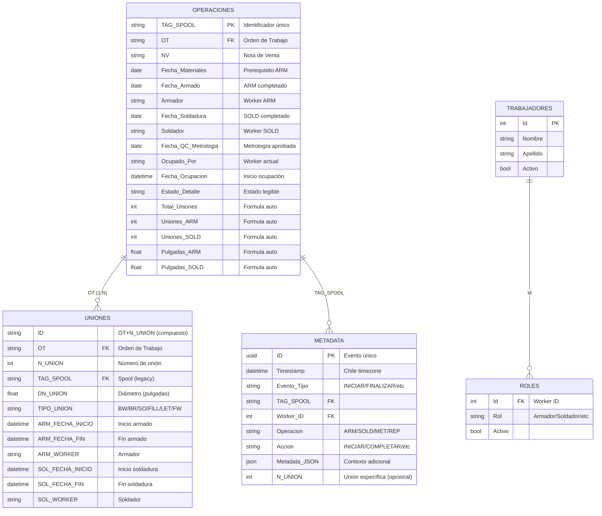

---

## 12. Roles y Permisos

| Operación | Roles Permitidos | Notas |
|---|---|---|
| **ARM** (INICIAR/FINALIZAR) | Armador, Ayudante | Ayudante puede armar |
| **SOLD** (INICIAR/FINALIZAR) | Soldador, Ayudante | Ayudante puede soldar |
| **METROLOGÍA** (Inspección) | Metrologia | Solo inspectores certificados |
| **REPARACIÓN** (INICIAR/FINALIZAR) | Cualquier trabajador activo | Sin restricción de rol |

---

## 13. Condiciones de Error

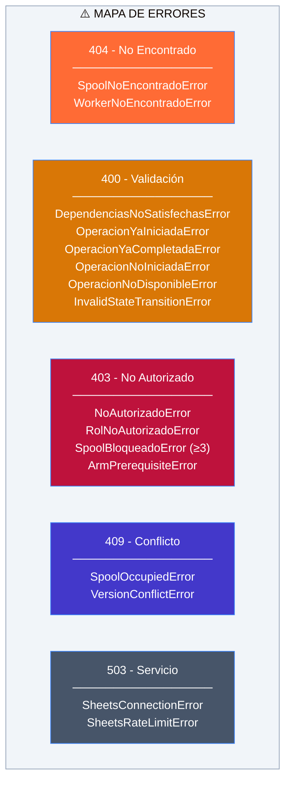

---

## 14. Pulgadas-Diámetro: Métrica de Negocio

```mermaid
%%{init: {'theme':'base','themeVariables':{'primaryColor':'#DBEAFE','primaryBorderColor':'#3B82F6','primaryTextColor':'#1E293B','secondaryColor':'#E0E7FF','tertiaryColor':'#F0F9FF','lineColor':'#475569','clusterBkg':'#F1F5F9','clusterBorder':'#94A3B8','nodeBorder':'#3B82F6','mainBkg':'#DBEAFE','edgeLabelBackground':'#F8FAFC'}}}%%
flowchart LR
    UNION1["Unión 1<br/>DN_UNION = 4.0\""]
    UNION2["Unión 2<br/>DN_UNION = 6.0\""]
    UNION3["Unión 3<br/>DN_UNION = 2.5\""]

    UNION1 --> SUM["Σ Pulgadas<br/>= 12.5\""]
    UNION2 --> SUM
    UNION3 --> SUM

    SUM --> DISPLAY["Mostrado en<br/>─────────────────<br/>P4b (selección uniones)<br/>P5 (confirmación)<br/>P6 (éxito)<br/>Metadata (audit)"]

    NOTE["La métrica pulgadas-diámetro<br/>es la suma de DN_UNION de las<br/>uniones seleccionadas/completadas.<br/>Es el KPI principal de productividad."]

    style SUM fill:#FF6B35,color:#fff
    style DISPLAY fill:#0369A1,color:#fff
    style NOTE fill:#001F3F,color:#fff
```

---

## 15. Resumen Visual: ¿Qué Pantalla Llama a Qué API?

| Pantalla | API Call | Método | Cuándo |
|---|---|---|---|
| **P1** | `GET /api/workers` | getWorkers() | Al montar (cachea en context) |
| **P3** | `GET /api/v4/uniones/{tag}/metricas` | getUnionMetricas() | Detección de versión v3.0/v4.0 |
| **P4** | `GET /api/spools/iniciar?op=X` | getSpoolsDisponible() | INICIAR, Metrología |
| **P4** | `GET /api/spools/ocupados?op=X&worker_id=Y` | getSpoolsOcupados() | FINALIZAR |
| **P4** | `POST /api/v4/occupation/iniciar` | iniciarSpool() | INICIAR spool único (inline) |
| **P4b Uniones** | `GET /api/v4/uniones/{tag}/disponibles?op=X` | getDisponiblesUnions() | FINALIZAR v4.0 |
| **P4b Metro** | `POST /api/metrologia/completar` | completarMetrologia() | APROBADO/RECHAZADO |
| **P5** | `POST /api/v4/occupation/iniciar` | iniciarSpool() | Confirmar INICIAR |
| **P5** | `POST /api/v4/occupation/finalizar` | finalizarSpool() | Confirmar FINALIZAR ARM/SOLD |
| **P5** | `POST /api/v4/occupation/iniciar` | iniciarSpool() | Confirmar INICIAR REP |
| **P5** | `POST /api/v4/occupation/finalizar` | finalizarSpool() | Confirmar FINALIZAR REP |
